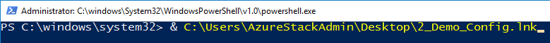

# __Deploy Azure Stack Development Kit on an Azure VM__

## __Description__

Creates a new Azure VM and installs prerequisites to install the AzureStack Development kit (ASDK)


## __Intent__

Facilitate [Azure Stack](https://azure.microsoft.com/en-us/overview/azure-stack/) learning and [Azure Stack Operator](https://azure.microsoft.com/en-us/blog/why-your-team-needs-an-azure-stack-operator/) training


## __Process__

### __Visualize ARM Template__

[](http://armviz.io/#/?load=https%3A%2F%2Fraw.githubusercontent.com%2FRKauf00%2FAzureStackDevKit%2Fmaster%2Fazuredeploy.json)  


### __Deploy ARM template__

- [*recommended*] Update and Run *New-AzStackARMDeployment.ps1*
    - Set __$instanceIdentifier__ to a unique value prior to running  
          
    - Update the __$gitBranch__ variable to target desired branch (case sensitive)  
          
- [Azure Commercial](https://aka.ms/Azure-AzStackPOC)  
[](https://portal.azure.com/#create/Microsoft.Template/uri/https%3A%2F%2Fraw.githubusercontent.com%2FRKauf00%2FAzureStackDevKit%2Fmaster%2Fazuredeploy.json)  
- [Azure US Government](https://aka.ms/AzureGov-AzStackPOC)  
[](https://portal.azure.us/#create/Microsoft.Template/uri/https%3A%2F%2Fraw.githubusercontent.com%2FRKauf00%2FAzureStackDevKit%2Fmaster%2Fazuredeploy.json)


### __Implement and Configure ASDK__

  - Log on to Azure VM as __administrator__  
        
  - Launch desktop installer shortcut (1_Install-ASDK | __run as administrator__)  
        
  - Provide __administrator__ password when prompted
  - Authenticate to Azure AD when prompted  
        
  - Following automatic restart; log back on to Azure VM using **AzureStack\AzureStackAdmin** (same password as administrator)  
        
  - Validate ISO file downloads
    - If an ISO failed to download, use appropriate [link below](\README.md#ISO%20Download%20URIs) to download it  
      - Windows Server 2019 | D:\WS2019EVALISO.iso
      - Windows Server 2016 | D:\WS2016EVALISO.iso
      - Windows 10 Enterprise | D:\Win10EntEval.iso
  - Launch PowerShell session (__Run as administrator__)
  - Run demo configuration script: ``` & C:\Users\AzureStackAdmin\Desktop\2_Demo_Config.lnk ```  
         
  - When prompted:
    - Provide new VM password when prompted  
    - Provide __AzureStack\AzureStackAdmin__ password when prompted  
    - Provide __Azure AD Account Name__ when prompted  
    - Provide __Azure AD Account Password__ when prompted  
  - [*optional*] Update Default Browser to Edge (Chromium)  
  - Launch Azure Stack Admin Portal shortcut on desktop  
  - Validate Portal connection and authentication  


## __Notes and Reference Material__

#### __ISO Download URIs__

__Note:__ Programatic ISO download occasionally fails due to a timeout error; these links can be used to retrieve the missing file(s)

 - [Windows Server 2019 -Evaluation (Save as D:\WS2019EVALISO.iso)](https://software-download.microsoft.com/download/17763.253.190108-0006.rs5_release_svc_refresh_SERVER_EVAL_x64FRE_en-us.iso)
 - [Windows Server 2016 - Evaluation (Save as D:\WS2016EVALISO.iso)](http://download.microsoft.com/download/1/4/9/149D5452-9B29-4274-B6B3-5361DBDA30BC/14393.0.161119-1705.RS1_REFRESH_SERVER_EVAL_X64FRE_EN-US.ISO)
 - [Windows 10 Enterprise - Evaluation (Save as D:\Win10EntEval.iso)](https://software-download.microsoft.com/download/18363.418.191007-0143.19h2_release_svc_refresh_CLIENTENTERPRISEEVAL_OEMRET_x64FRE_en-us.iso)


#### __Pending Checks and Updates__

  - 


#### __Example__

`
PS C:\Temp> & "<PathToFile>\New-AzStackARMDeployment.ps1"
`


#### __Microsoft Docs ASDK PDF__

`
C:\Users\AzureStackAdmin\Desktop\Learning Material\MSDocs-ASDK-28FEB2020.pdf
`

#### __Getting Start with Azure Stack Links__

`
C:\Users\AzureStackAdmin\Desktop\Learning Material\MSDocs-ASDK-28FEB2020.pdf
`

## __Updates / Change log__

### __08.04.2019__
- Tested with ASDK 1.1907.0.20


# __*Enjoy!*__
